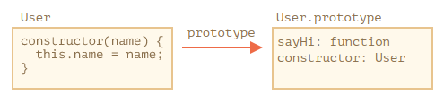
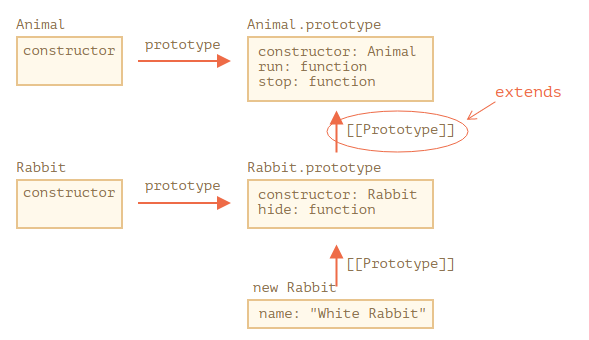

# Class

В JavaScript класс – это разновидность функции.

```
class User {
  constructor(name) { this.name = name; }
  sayHi() { alert(this.name); }
}

// класс - это функция
alert(typeof User); // function

// ...или, если точнее, это метод constructor
alert(User === User.prototype.constructor); // true

// Методы находятся в User.prototype, например:
alert(User.prototype.sayHi); // alert(this.name);

// в прототипе ровно 2 метода
alert(Object.getOwnPropertyNames(User.prototype)); // constructor, sayHi
```

Вот что на самом деле делает конструкция `class User {...}`:

- Создаёт функцию с именем `User`, которая становится результатом объявления класса. Код функции берётся из метода `constructor` (она будет пустой, если такого метода нет).
- Сохраняет все методы, такие как `sayHi`, в `User.prototype`.



## Не просто синтаксический сахар

Важные отличия:

- Функция, созданная с помощью `class`, помечена специальным внутренним свойством `[[FunctionKind]]:"classConstructor"`. Поэтому это не совсем то же самое, что создавать её вручную.
- В отличие от обычных функций, конструктор класса не может быть вызван без new:
- Методы класса являются неперечислимыми. Определение класса устанавливает флаг `enumerable` в `false` для всех методов в **"prototype"**.
- Классы всегда используют use strict. Весь код внутри класса автоматически находится в строгом режиме.

```
class MyClass {
  prop = value; // свойство
  constructor(...) { // конструктор
    // ...
  }
  method(...) {} // метод
  get something(...) {} // геттер
  set something(...) {} // сеттер
  [Symbol.iterator]() {} // метод с вычисляемым именем (здесь - символом)
  // ...
}
```

## Наследование

```
class Animal {
  constructor(name) {
    this.speed = 0;
    this.name = name;
  }
  run(speed) {
    this.speed = speed;
    alert(`${this.name} бежит со скоростью ${this.speed}.`);
  }
  }
}

// Наследуем от Animal указывая "extends Animal"
class Rabbit extends Animal {
  hide() {
    alert(`${this.name} прячется!`);
  }
}
```

Ключевое слово extends работает, используя прототипы. Оно устанавливает `Rabbit.prototype.[[Prototype]]` в `Animal.prototype`. Так что если метод не найден в `Rabbit.prototype`, JavaScript берёт его из `Animal.prototype`.



У классов есть ключевое слово **"super"** для таких случаев.

- `super.method(...)` вызывает родительский метод.
- `super(...)` вызывает родительский конструктор (работает только внутри нашего конструктора).

### Super в классах-потомках

<mark>В классах-потомках конструктор обязан вызывать `super(...)`, и **(!)** делать это перед использованием `this`</mark>. В JS существует различие между **«функцией-конструктором наследующего класса»** и всеми остальными. В наследующем классе соответствующая функция-конструктор помечена специальным внутренним свойством `[[ConstructorKind]]:"derived"`.

Разница в следующем:

- Когда выполняется обычный конструктор, он создаёт пустой объект и присваивает его `this`.
- Когда запускается конструктор унаследованного класса, он этого не делает. Вместо этого он ждёт, что это сделает конструктор родительского класса.

Поэтому, если мы создаём собственный конструктор, мы должны вызвать super, в противном случае объект для `this` не будет создан, и мы получим ошибку.

---

# References

[JS Классы](https://learn.javascript.ru/classes)
