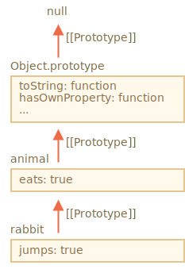

# Inheritance

---

[Наследование в классах](/Javascript/class)

---

В JS наследование реализовано с помощью **прототипов**.

В JavaScript все объекты имеют скрытое свойство `[[Prototype]]`, которое является либо другим объектом, либо `null`. Когда мы хотим прочитать свойство из `object`, а оно отсутствует, JavaScript автоматически ищет его в прототипе.



Свойство `[[Prototype]]` является внутренним и скрытым, но есть много способов задать его.

```
let animal = {
  eats: true
};
let rabbit = {
  jumps: true
};

rabbit.__proto__ = animal;
```

Прототип используется только для чтения свойств. Операции записи/удаления работают напрямую с объектом.
<mark>Свойства-аксессоры – исключение, так как запись в него обрабатывается функцией-сеттером. То есть, это, фактически, вызов функции.</mark>

```
let user = {
  name: "John",
  surname: "Smith",

  set fullName(value) {
    [this.name, this.surname] = value.split(" ");
  },

  get fullName() {
    return `${this.name} ${this.surname}`;
  }
};

let admin = {
  __proto__: user,
  isAdmin: true
};

alert(admin.fullName); // John Smith (*)

// срабатывает сеттер!
admin.fullName = "Alice Cooper"; // (**)
alert(admin.name); // Alice
alert(admin.surname); // Cooper
```

## Функции конструкторы

- Свойство `F.prototype` (не путать с `[[Prototype]]`) устанавливает `[[Prototype]]` для новых объектов при вызове `new F()`.
- Значение `F.prototype` должно быть либо объектом, либо `null`. Другие значения не будут работать.
- Свойство **"prototype"** является особым, только когда оно назначено **функции-конструктору**, которая вызывается оператором `new`. В обычных объектах prototype не является чем-то особенным.
- По умолчанию все функции имеют `F.prototype = { constructor: F }`, поэтому мы можем получить конструктор объекта через свойство `constructor`

```
function Rabbit() {}
// по умолчанию:
// Rabbit.prototype = { constructor: Rabbit }

let rabbit = new Rabbit(); // наследует от {constructor: Rabbit}

alert(rabbit.constructor == Rabbit); // true (свойство получено из прототипа)
```

<mark>Важно:</mark>

> Не меняйте [[Prototype]] существующих объектов, если важна скорость
> Технически мы можем установить/получить [[Prototype]] в любое время. Но обычно мы устанавливаем прототип только раз во время создания объекта, а после не меняем: rabbit наследует от animal, и это не изменится.

> И JavaScript движки хорошо оптимизированы для этого. Изменение прототипа «на лету» с помощью Object.setPrototypeOf или obj.**proto**= – очень медленная операция, которая ломает внутренние оптимизации для операций доступа к свойствам объекта. Так что лучше избегайте этого кроме тех случаев, когда вы знаете, что делаете, или же когда скорость JavaScript для вас не имеет никакого значения.

---

# References

- [Прототипы, наследование](https://learn.javascript.ru/prototypes)
- [Наследование классов](https://learn.javascript.ru/class-inheritance)
