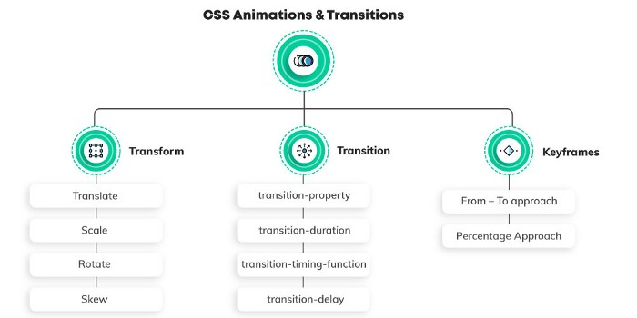
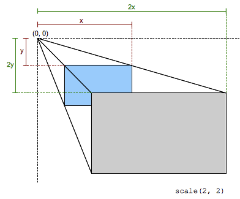

# Анимации

Есть три главные аспекта анимации в CSS:

- Transition
- Transform
- Keyframes



## Transform

Transform позволяет изменять веб элементы с помощью различных методов.

Методы:

- `translate`
- `scale`
- `rotate`
- `skew`

### Translate

CSS функция `translate()` перемещает элемент по горизонтали и\или вертикали. Её результатом является набор данных типа `<transform-function>`.


Трансформация характеризуется двумерным вектором. Его координаты указывают на сколько сдвигается элемент в каждом направлении.

### Rotate

CSS функция `rotate()` определяет трансформацию вращения элемента вокруг фиксированной точки на двумерном плоскосте. Её результатом является набор данных типа `<transform-function>`.

Фиксированная точка вокруг которой вращается элемент - по умолчанию установлена в центре элемента, но можно изменить ее положение с помощью свойства `transform-origin`.

### Skew

CSS функция `skew()` определяет трансформацию по искажению элемента на 2D плоскосте. Её результатом является набор данных типа `<transform-function>`.

Трансформация - это отображение сдвига который искажает каждую точку внутри элеента под определенным углом в горизонтальном и вертикальном направлениях. Координаты каждой точки модицицируются по значению пропорционально специальному углу и дистанции к источнику.

### Scale

CSS функция `scale()` изменяет размер элемента в 2D плоскосте. По-сколькку величина масштабирования определяется вектором, то горизонтальное и вертикальное масштабирование могут различаться. Её результатом является набор данных типа `<transform-function>`.

This scaling transformation is characterized by a two-dimensional vector. Its coordinates define how much scaling is done in each direction. If both coordinates are equal, the scaling is uniform (isotropic) and the aspect ratio of the element is preserved (this is a homothetic transformation).

When a coordinate value is outside the [-1, 1] range, the element grows along that dimension; when inside, it shrinks. If it is negative, the result a point reflection in that dimension. A value of 1 has no effect.



### Трансформы можно комбинировать

```
transform: translateX(200px) rotateX(45deg) scaleY(1.5) skewX(45deg);
```

## Transition

Transition (переходы) с помощью них можно создавать анимации переходов из одного состояния в другое и управлять ими.

Управление `transition` происходит с помощью следующих свойств:

- transition-property
- transition-duration
- transition-timing-function
- transition-delay

```
/* property name | duration | timing function | delay */
transition: margin-right 4s ease-in-out 1s;
```

### transition-property

These are the CSS properties that one can use transitions on. This ranges from playing with margins and paddings to background and borders. You can either apply a transition to a specific feature or to a complete list. A comprehensive list of all the properties that come under this purview can be found here.
Applying transition property to a specific CSS property

```
transition-property: background-color;
```

Applying a transition to the entire list of CSS properties

```
transition-property: all;
```

### transition-duration

The time duration for which the animation will be in play. This can easily be measured in seconds (s) or milliseconds (ms). It is advisable to use seconds as it makes them easily readable — even your fellow developers at the office won’t get annoyed by you!
transition-duration: 0.5s;

### transition-timing-function

Speed is something that can make or break the user experience with your animation; therefore it is advisable to control it. The way you can accomplish it is by using transition-timing-function.
Pupils at CSS 3 team were kind enough to provide us with some in-built values for speed, like ease, ease-in, ease-in-out
And in case, you wish to possess total command over the speed — Use Bezier Curves.

```
transition-timing-function: ease;
transition-timing-function: cubic-bezier(0.25, 0.1, 0.25, 1);
```

### transition-delay

This helps in creating a pause between the event getting fired that starts the animation and the actual start of the animation. Simply put, transition-delay — delays the animation. It is measured in seconds (s) or milliseconds (ms).

```
transition-delay: 0.5s;
```

Shorthand:

```
transition: (property) (duration) (transition-timing-function) (transition-delay);
```

## KeyFrames

The keyframes help in changing the animation from one to another at certain times.

One can play with keyframes in two ways:

- From — To approach
- Percentage Approach

### From — To Approach

In this approach, there are only 2 states during the animation — start state and end state.
Syntax:

```
@keyframes animation_name {
    from { }
    to { }
}
```

To animate an element (e.g., a Car) to move horizontally from its initial position:

```
@keyframes drive{
    from {
        transform: translateX(-200);
    }
    to {
        transform: translateX(1000px);
    }
}

.car {
    animation-name: drive;
    animation-duration: 3s;
    animation-fill-mode: forwards;
    animation-delay: 2s;
    animation-iteration-count: infinite;
    animation-timing-function: ease-in;
    animation-direction: normal;
}
```

### Percentage Approach

We cannot use from-to in @keyframes as there is more than 1 state now. The percentage approach breaks down the animation into various intermediate states including a start and end state. The start state is indicated by 0%, and the end state is indicated by 100%. There can be as many intermediate states you want, but it is advised to keep the segregation of states uniform throughout.

**Example: 0% — 25% — 50% — 75% — 100%**

```
@keyframes jump {
    0% { transform: translateY(-50px) }
    50% { transform: translateY(-100px) }
    100% { transform: translateY(-50px) }
}
```

#### What is Chaining Animations?

Playing with multiple animations is a breeze with CSS. Comma separation technique can be used to chain the animation and run one animation after the other. For example,

```
.car{
    animation: drive 3s ease-in infinite normal 2s, jump 2s ease 4 alternate reverse;
}
```

## JS animation handlers

### animationstart

The animationstart event is fired when a CSS Animation has started. If there is an animation-delay, this event will fire once the delay period has expired. A negative delay will cause the event to fire with an elapsedTime equal to the absolute value of the delay (and, correspondingly, the animation will begin playing at that time index into the sequence).

### animationend

The animationend event is fired when a CSS Animation has completed. If the animation aborts before reaching completion, such as if the element is removed from the DOM or the animation is removed from the element, the animationend event is not fired.

### animationiteration

The animationiteration event is fired when an iteration of a CSS Animation ends, and another one begins. This event does not occur at the same time as the animationend event, and therefore does not occur for animations with an animation-iteration-count of one.

### animationcancel

The animationcancel event is fired when a CSS Animation unexpectedly aborts. In other words, any time it stops running without sending an animationend event. This might happen when the animation-name is changed such that the animation is removed, or when the animating node is hidden using CSS. Therefore, either directly or because any of its containing nodes are hidden.

---

# References

[mdn animation](https://developer.mozilla.org/en-US/docs/Web/CSS/transition)
[Medium](https://medium.com/engineerbabu/a-detailed-guide-to-css-animations-and-transitions-b544502c089c)
