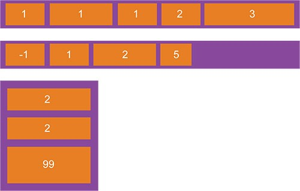

# Flexbox

## Основы и терминология

Так как <mark>flexbox</mark> является полноценным модулем, а не простым свойством, он включает в себя множество интересного, а в частности полный набор рабочих свойств. Некоторые из них созданы для использования на контейнере (родительский элемент, известный как flex-container), в то время как другие должны помогать исполнять свои роли дочерним элементам.
Если обычный шаблон основан как на блочных, так и на инлайновых элементах, формирующих поток, то flex-шаблон основан на нескольких потоках. Посмотрите на это изображение, наглядно показывающее основную идею flex шаблонизации.


Элементы в flexbox могут располагаться вдоль основной оси (от `main-start` до `main-end`) или же вдоль поперечной оси (от `cross-start` до `cross-end`).

**Main axis** — основная ось flex контейнера, вдоль которой располагаются flex элементы. `flex-direction` определяет направление оси **main**.

**Main-start** | **main-end** — flex элементы расположены в рамках контейнера, начиная от **main-start** и заканчивая **main-end**.

**Main-size** — высота или ширина flex элемента, что зависит от того, в каком направлении идёт основная ось.

**Cross axis** — ось перпендикулярная главной оси, называется поперечной. Её направление зависит от направления главной оси.

**Cross-start | cross-end** — flex линии, заполненные элементами и расположенные в контейнере от **cross-start** до **cross-end**.

**Cross-size** — Ширина или высота flex-элемента, в зависимости от направления главной оси.

## Свойства родительских элементов (flex-container)

### #display


Это свойство создаёт сам flex контейнер, инлайновый или блочный, в зависимости от заданного значения. Также оно задает flex-контекст каждому прямому потомку.

```
.container {
  display: flex; /* или inline-flex */
}
```

> Учтите, что CSS колонки не имеют эффекта на flex контейнер.

[магия inline-flex](https://medium.com/@stasonmars/%D0%BC%D0%B8%D1%81%D1%82%D0%B8%D1%87%D0%B5%D1%81%D0%BA%D0%B8%D0%B8%CC%86-inline-flex-%D0%B8-%D1%87%D1%82%D0%BE-%D0%BE%D0%BD-%D0%B4%D0%B5%D0%BB%D0%B0%D0%B5%D1%82-35997951ff03)

### flex-direction


Устанавливает направление главной оси **main-axis** и определяет направление flex элементов размещенных в flex контейнере. Flexbox это односторонняя концепция представления шаблонизации. Поэтому flex элементы располагаются, в основном, вдоль горизонтальной или поперечной линии.

```
.container {
  flex-direction: row | row-reverse | column | column-reverse;
}
```

- `row` (стандартное положение) — слева направо.
- `row-reverse` — элементы располагаются справа налево.
- `column` — тоже самое, что и row, только сверху вниз.
- `column-reverse` — тоже самое, что и `row-reverse`, но снизу вверх.

### flex-wrap


```
.container{
  flex-wrap: nowrap | wrap | wrap-reverse;
}
```

Изначально все flex-элементы будут пытаться уместиться в одну строку. Вы можете поменять это и дать возможность этим элементам переходить на другую строку, при необходимости.

- `nowrap` — это значение по-дефолту, при котором все flex элементы будут выстраиваться в одну линию.
- `wrap` — flex элементы будут переноситься на несколько строк, от верха к низу.
- `wrap-reverse` — flex элементы будут переноситься на несколько строк снизу вверх.

### #flex-flow (применяется для родительского flex контейнера)

Это сокращение `flex-direction` и `flex-wrap` свойств, которые вместе определяют направление главной и поперечной оси. По-дефолту оно имеет значение row nowrap.

```
flex-flow: <'flex-direction'> || <'flex-wrap'>
```

### #justify-content

Свойство определяет выравнивание вдоль главной оси. Оно помогает распределить лишнее свободное пространство, когда, либо все flex элементы в линии имеют фиксированный размер, либо же нет, но уже достигли своего максимального размера. Оно также влияет на выравнивание элементов, когда те переполнят строку.

```
.container {
  justify-content: flex-start | flex-end | center | space-between | space-around | space-evenly;
}
```

- `flex-start` — дефолтное состояние, при котором элементы расставляются от начала строки.
- `flex-end` — состояние, в котором элементы размещены с конца строки.
- `center` — элементы центрированы вдоль строки.
- `space-between` — элементы равномерно распределены по строке, первый элемент находится вначале строки, последний в конце.
- `space-around` — элементы равномерно распределены по строке с равным местом вокруг них. Учтите, что визуально пробелы не равномерны, так как все элементы имеют одинаковые пробелы с двух сторон. Первый элемент получит одну единицу свободного места от границы контейнера, но получит две единицы свободного места от следующего элемента, так как у него тоже есть одна единица свободного места с каждой из сторон.
- `space-evenly` — элементы распределены таким образом, что свободное пространство между любыми двумя элементами равномерно, как и место до границы края контейнера.

### #align-items


Это свойство определяет стандартное поведение того, как flex элементы будут располагаться вдоль поперечной оси на заданной строке. Это своебразная версия justify-content, но только для поперечной оси, которая перпендикулярна главной.

```
.container {
  align-items: stretch | flex-start | flex-end | center | baseline;
}
```

- `flex-start` — всё размещается с начала поперечной оси
- `flex-end` — все элементы размещаются с конца поперечной оси
- `center` — элементы центрируются по поперечной оси
- `baseline` — элементы выравниваются по базовой линии
- `stretch` — это дефолтное состояние, при котором элементы заполяют контейнер, с учетом `min-width` и `max-width`.

### #align-content

Это свойство выравнивает и распределяет строки контейнера, когда есть свободное пространство в поперечной оси, подобно тому как justify-content, оно выравнивает элементы по главной оси.
Учтите, что это свойство не приности эффекта, когда есть только одна строка flex элементов.

```
.container {
  align-content: flex-start | flex-end | center | space-between | space-around | stretch;
}
```

- `flex-start` — строки расположены от начала контейнера.
- `flex-end` — строки расположены от конца контейнера.
- `center` — строки расположены от центра контейнера.
- `space-between` — строки равномерно распределены, первая строка находится вначале контейнера, тогда как последняя находится в конце.
- `space-around` — строки равномерно распределены с равным местом вокруг каждой строки.
- `stretch` — стандартное состояние, при котором строки растягиваются на вся оставшееся место.

## Свойства дочерних элементов

### #order



По-дефолту, флекс элементы располагаются в исходном порядке 1, 2, 3 и т.д. Однако, свойство order контролирует порядок в котором элементы могут располагаться.

```
.item {
  order: <любое целое число>; /* дефолтное 0 */
}
```

### #flex-grow


Это свойство определяет способность flex элемента при необходимости становится больше. Оно принимает безразмерное значение, которое служит пропорцией или долей. Оно указывает какое количество свободного места внутри контейнера элемент должен взять.
Если все элементы в контейнере имеют flex-grow со значением 1, то это означает то, что оставшееся место в нём распределено в равной мере среди потомков. Также, помните, что оно не принимает негативных значений.

```
.item {
  flex-grow: <число>; /* дефолтное 0 */
}
```

[flex-grow подробно](https://medium.com/@stasonmars/%D0%BA%D0%B0%D0%BA-%D1%80%D0%B0%D0%B1%D0%BE%D1%82%D0%B0%D0%B5%D1%82-flex-grow-%D0%B2-css-%D0%BF%D0%BE%D0%B4%D1%80%D0%BE%D0%B1%D0%BD%D0%BE%D0%B5-%D1%80%D1%83%D0%BA%D0%BE%D0%B2%D0%BE%D0%B4%D1%81%D1%82%D0%B2%D0%BE-557d406be844)

### #flex-shrink

Это свойство определяет способность flex элемента сокращаться при необходимости. Оно также не принимает отрицательных значений.
Вообще тоже очень интересное свойство, с которым у многих бывают проблемы при реализации.

```
.item {
  flex-shrink: <число>; /* дефолтное 1 */
}
```

[полное руководство к flex-shrink](https://medium.com/@stasonmars/%D0%BA%D0%B0%D0%BA-%D1%80%D0%B0%D0%B1%D0%BE%D1%82%D0%B0%D0%B5%D1%82-flex-shrink-%D0%B2-css-%D0%BF%D0%BE%D0%B4%D1%80%D0%BE%D0%B1%D0%BD%D0%BE%D0%B5-%D1%80%D1%83%D0%BA%D0%BE%D0%B2%D0%BE%D0%B4%D1%81%D1%82%D0%B2%D0%BE-c41e40767194)

### #flex-basis

Это свойство определяет стандартный размер элемента, перед тем как оставшееся место будет распределено. Это может быть длина (20%, 5rem и тп) или ключевое значение. Ключевое значение auto означает «эй, посмотрите на мои свойства ширины и высоты» (этим раньше занималось свойство main-size, пока не устарело и не было удалено). Значение content означает, что размер основывается на контенте элемента — это свойство пока что не очень хорошо поддерживается, поэтому его очень тяжело протестировать и довольно сложно понять, что делают его собратья, такие как max-content, min-content и fit-content.

```
.item {
  flex-basis: <длина> | auto; /* дефолтное auto */
}
```

Если выставить значение на 0, то дополнительное место вокруг контента не будет учтено. Если выставить на auto, то дополнительное свободное место будет распространяться, основываясь на его flex-grow значении. В общем, посмотрите график ниже.


[width vs flex-basis](https://medium.com/@stasonmars/%D1%80%D0%B0%D0%B7%D0%BD%D0%B8%D1%86%D0%B0-%D0%BC%D0%B5%D0%B6%D0%B4%D1%83-width-%D0%B8-flex-basis-f34e658ce6a2)

### #flex

Это сокращение для `flex-grow`, `flex-shrink` и `flex-basis` — все вместе взятые. Второй и третий параметры опциональны, то есть `flex-shrink` и `flex-basis`. По-дефолту оно имеет значение 0 1 auto.

```
.item {
  flex: none | [ <'flex-grow'> <'flex-shrink'>? || <'flex-basis'> ]
}
```

Рекомендуется использовать сокращенное свойство, вместо набора индивидуальных свойств. Оно выставляет другие значения должным образом, вернее грамотно.

### #align-self


Это свойство позволяет стандартному выравниванию (или если точно `align-items`) элементов, быть перезаписанному для определенного flex элемента.
Чтобы увидеть все значения `align-self`, посмотрите их в `align-items`.

```
.item {
  align-self: auto | flex-start | flex-end | center | baseline | stretch;
}
```

Примите во внимание, что `float`, `clear` и `vertical-align` не имеют эффекта на flex элементы.

---

### Links

- [Medium - Flex](https://medium.com/@stasonmars/%D0%B2%D0%B5%CC%88%D1%80%D1%81%D1%82%D0%BA%D0%B0-%D0%BD%D0%B0-flexbox-%D0%B2-css-%D0%BF%D0%BE%D0%BB%D0%BD%D1%8B%D0%B8%CC%86-%D1%81%D0%BF%D1%80%D0%B0%D0%B2%D0%BE%D1%87%D0%BD%D0%B8%D0%BA-e26662cf87e0)
- [A complete guide to flexbox](https://css-tricks.com/snippets/css/a-guide-to-flexbox/)
