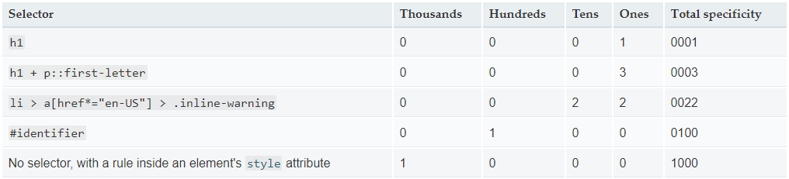

# Специфичность

Специфичность - способ , с помощью которого браузеры определяют, какие значения свойств CSS наиболее соответствуют элементу и будут применены. Специфичность основана на правилах соответствия, состоящих из селекторов CSS различных типов.

## Как вычисляется специфичность?

Специфичность - это вес, который имеется у каждого правила CSS. Вес правила определяется количеством каждого из типов селекторов в данном правиле.
Если у нескольких правил специфичность одинакова, то к элементу применяется последнее по порядку правило CSS. Специфичность имеет значение только в том случае, если один элемент соответствует нескольким правилам. Согласно спецификации CSS, правило для непосредственно соответствующего элемента всегда будет иметь больший приоритет, чем правила, унаследованные от предка.

> <mark>Примечание: Взаимное расположение элементов в дереве документа не влияет на специфичность.</mark>

## Типы селекторов

В следующем списке типы селекторов расположены по возрастанию специфичности:

1. селекторы типов элементов (например, `h1`) и псевдоэлементов (например, `::before`).
2. селекторы классов (например, `.example`), селекторы атрибутов (например, `[type="radio"]`) и псевдокласов (например, `:hover`).
3. селекторы идентификаторов (например, `#example`).

Универсальный селектор (`*`), комбинаторы (`+`, `>`, `~`, `' '`) и отрицающий псевдокласс (`:not()`) не влияют на специфичность. (Однако селекторы, объявленные внутри `:not()`, влияют)

Стили, обьявленные в элементе (например, `style="font-weight:bold"`), всегда переопределяют любые правила из внешних файлов стилей и, таким образом, их специфичность можно считать наивысшей.

Вес специфичности вычисляется по четерем различным значениям, которые можно рассматривать как тысячи, сотни, десятки и единицы - четыре числа в четырех колонках.

- Тысячи: считайте единицу если стили объявлены в `inline styles`. 1000
- Сотни: считайте едииницу за каждый ID селектор в правиле
- Десятки: считайте единицу за каждый class селектор, атрибут селектор или псевдо-класс селектор в правиле
- Единицы: считайте единицу за каждый элемент селектор или псевдо-элемент селектор в правиле

